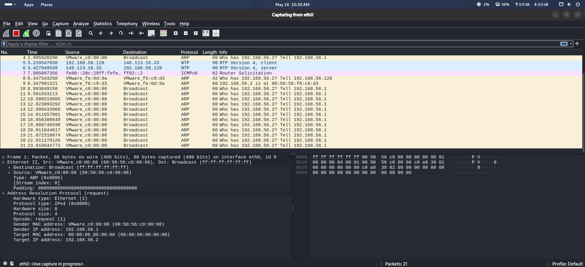
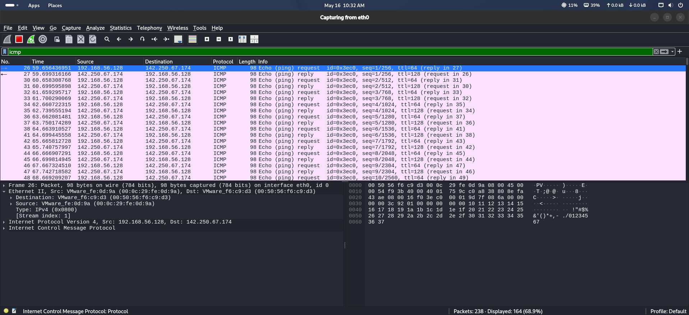
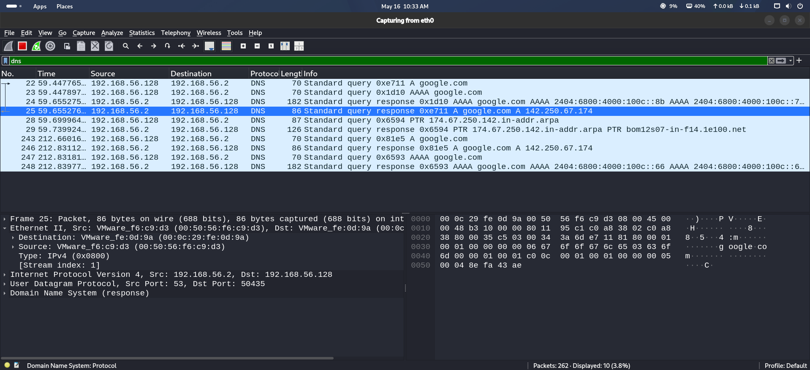
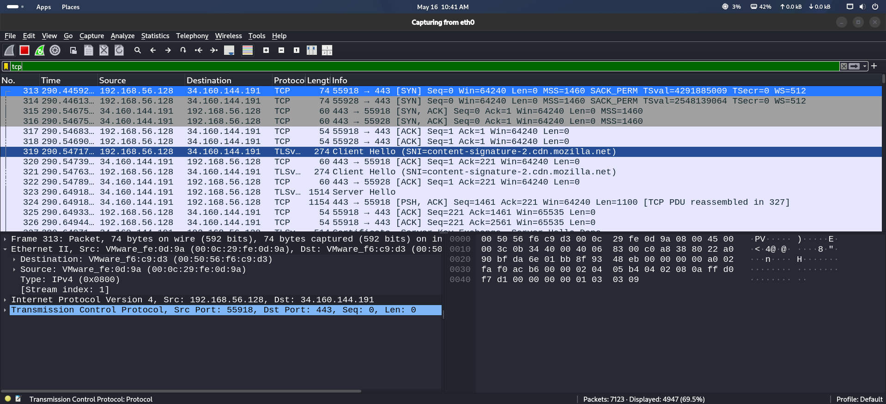
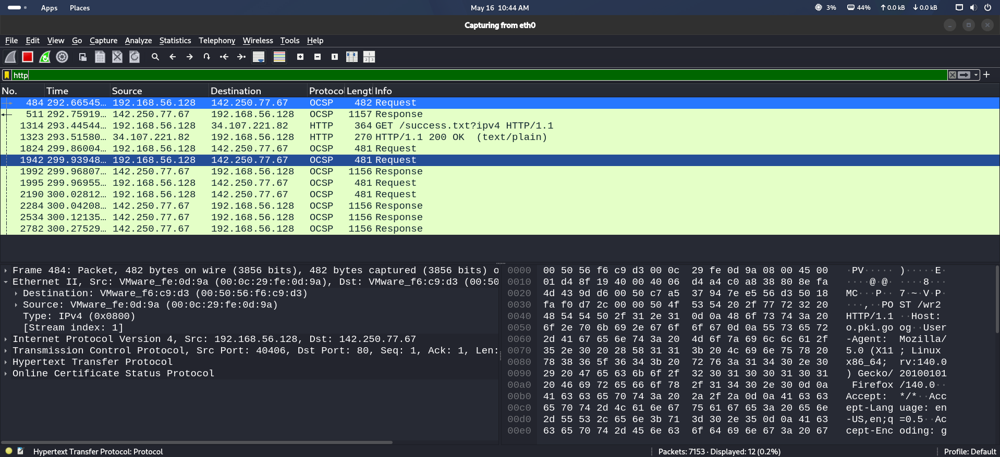

# Lab 3 — Wireshark Packet Analysis

## Objective

The objective of this lab is to learn basic packet capturing and network traffic analysis using Wireshark.

---

## Tools Used

- Kali Linux
- Wireshark

---

## Wireshark Installation

Update package lists:

```bash
sudo apt update
```

Install Wireshark:

```bash
sudo apt install wireshark -y
```

Launch Wireshark:

```bash
wireshark
```

Verify installation:

```bash
wireshark --version
```

---

## Topics Covered

- Packet capture
- ICMP traffic analysis
- DNS packet analysis
- HTTP traffic analysis
- Protocol filtering
- Network monitoring

---

## Skills Learned

- Network packet analysis
- Traffic filtering
- Protocol identification
- DNS analysis
- Troubleshooting network traffic

---

## Procedure

### 1. Start Wireshark

```bash
wireshark
```

Select the active network interface and start packet capture.

---

### 2. Generate ICMP Traffic

```bash
ping google.com
```

Apply filter:

```text
icmp
```

---

### 3. Generate DNS Traffic

```bash
nslookup google.com
```

Apply filter:

```text
dns
```

---

### 4. Analyze TCP Traffic

Apply filter:

```text
tcp
```

---

### 5. Analyze HTTP Traffic

Open browser and visit:

https://example.com

Apply filter:

```text
http
```

---

## Common Wireshark Filters

| Filter | Description |
|--------|-------------|
| `icmp` | Displays ICMP packets |
| `dns` | Displays DNS traffic |
| `http` | Displays HTTP traffic |
| `tcp` | Displays TCP packets |
| `udp` | Displays UDP packets |
| `arp` | Displays ARP packets |
| `tcp.port == 80` | Filters port 80 traffic |
| `tcp.port == 443` | Filters HTTPS traffic |

---

## Screenshots

### Packet Capture


### ICMP Analysis


### DNS Analysis


### TCP Traffic


### HTTP Analysis


---


## Conclusion

This lab provided hands-on experience with packet capturing and protocol analysis using Wireshark. It improved understanding of real-time network communication and traffic inspection.
