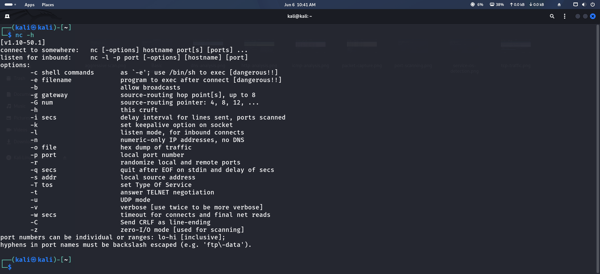
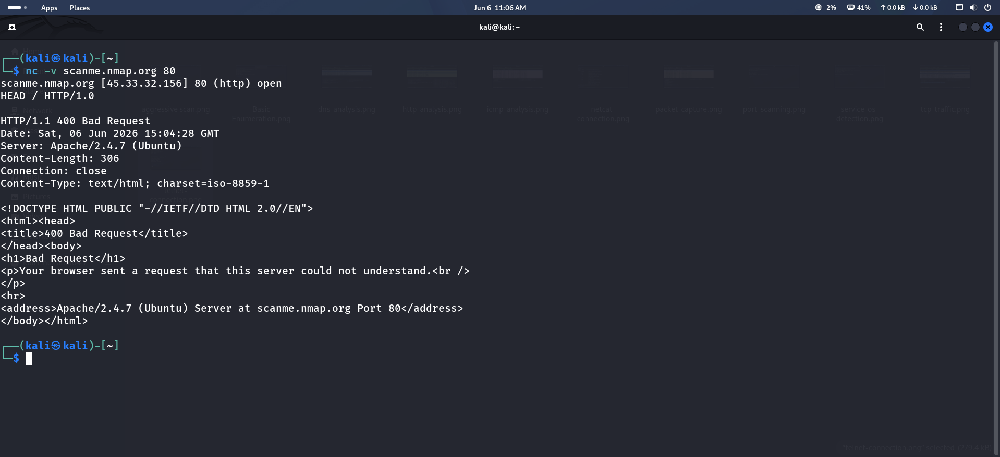
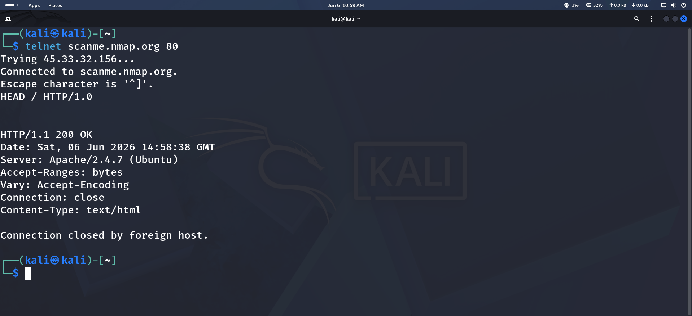

# Lab 4 — Network Enumeration Using Netcat & Telnet

## Objective

The objective of this lab is to learn basic network enumeration techniques using Netcat and Telnet. These tools help identify services, test connectivity, and perform banner grabbing.

---

## Tools Used

- Kali Linux
- Netcat (nc)
- Telnet

---

## Installation

Install Telnet:

```bash
sudo apt update
sudo apt install telnet -y
```

Verify Netcat:

```bash
nc -h
```

Verify Telnet:

```bash
telnet
```

---

## Topics Covered

- Banner grabbing
- Service enumeration
- Port connectivity testing
- TCP connections
- Basic reconnaissance

---

## Skills Learned

- Network service identification
- Connectivity testing
- Port verification
- Banner grabbing
- Enumeration techniques

---

## Procedure

### 1. Check HTTP Port

```bash
nc -nv scanme.nmap.org 80
```

---

### 2. Banner Grabbing

```bash
nc -nv scanme.nmap.org 80
```

After connection:

```text
HEAD / HTTP/1.0
```

Press Enter twice.

---

### 3. Telnet Connection

```bash
telnet scanme.nmap.org 80
```

---

### 4. Test HTTPS Port

```bash
nc -nv scanme.nmap.org 443
```

---

### 5. Port Enumeration (Scan Multiple Ports)

```bash
nc -zv scanme.nmap.org 80 443
```

---

## Important Commands

| Command | Description |
|----------|-------------|
| nc -nv host port | Connect to service |
| nc -zv host port | Port scan |
| telnet host port | Test TCP connectivity |
| nc -h | Help menu |
| telnet | Launch Telnet |

---

## Screenshots

### Netcat Connection


### Banner Grabbing


### Telnet Connection


### Port Enumeration


---


## Conclusion

This lab provided hands-on experience with network enumeration, banner grabbing, and service verification using Netcat and Telnet.
